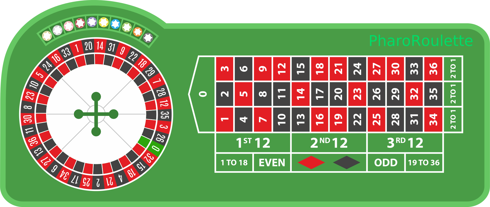

# PharoRoulette Alpha

This project has started during the ESUG 2017. Inspired by the many speakers I wanted to learn more about web development using Seaside and in particular using callbacks. I'm no professional Smalltalker so please be free to comment my chosen solutions.

#### _Rien ne va plus !_



As this is a learning experience, below my findings:

### Detecting click input
The first idea was to build a Roulette table made of seperate div's but this was way too time-consuming. So an alternative was explored... using a image of a Roulette table the relative position of the mouse click event is detected; using cascaded `callback: value:` messages all the necessary attributes are collected:

```Smalltalk
renderClickScriptOn: html
	^ html jQuery ajax
		callback: [ :x | self pointer x: x asInteger ] value: JQEvent new pageX;
		callback: [ :y | self pointer y: y asInteger ] value: JQEvent new pageY;
		callback: [ :l | self offsetLeft: l asInteger ] value: html jQuery this offsetLeft;
		callback: [ :t | self offsetTop: t asInteger ] value: html jQuery this offsetTop.
```
### Processing and responding
After the click attributes are received, the backend determines which part of the table is clicked. To confirm the result a pointer is shown at the spot where the table is clicked.

Note to myself: http://pillarhub.pharocloud.com/hub/mikefilonov/ajaxupdateseaside

### Docker RUN command
``` Docker
docker run -d -p 8088:8088 --rm --name pharoroulette wvzuilen/pharoroulette:latest
```

### Metacello load script
```Smalltalk
Metacello new
 baseline:'PharoRoulette';
 repository: 'github://wvzuilen/PharoRoulette:master/src';
 load.
```
